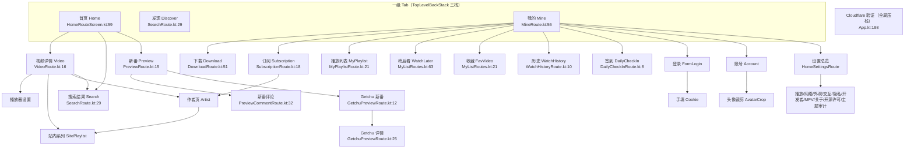

# LoveHan1me 产品完成度盘点

> 方法：只读 `app/`、`shared/`、`video/`、`desktopApp/` 源码（863 个 kt），未读任何 `docs/` 文档、未看 git log。每条结论附 `file:line`。

## 一句话结论

**它是一个「工程质量很高、但产品形态仍是网站镜像」的第三方客户端**——写假数据的空壳基本没有（全仓假数据只在 `feature/preview/ComposePreviewDataSource.kt`，仅被 `@Preview` 引用；`SubscriptionContent.kt:60` 那处 import 已无人使用），播放器与下载甚至超过多数同类开源项目；但它缺的是**内容平台那一层**：没有推荐 Feed、没有搜索联想/热搜、没有投屏/后台听音/字幕，首屏永远是站点首页那几排分类。对标哔哩哔哩 Mobile，大致处在 **「网页下载器的完成版」而非「视频客户端」** 的水位。

## 页面关系图

共 **~37 个可到达路由**（`HanimeScreen.kt:9-132` 定义 20 个键 + 设置 13 页 + 平台注入 4 页）。

## 逐屏完成度

| 屏幕 | 入口 | 档 | 判定依据 |
|---|---|---|---|
| 首页 | `HomeRouteScreen.kt:59` | **B** | 有 loading/error/empty（`SharedHomeScreen.kt:173-188`）、下拉刷新（`:163`）、首屏 HTML 缓存（`:141-152`）；但一次性取整页站点首页（`HomePageViewModel.kt:155`），无分页/无推荐；分类卡长按是空实现（`HomePageContent.kt:179-181`） |
| 发现/搜索 | `SearchRoute.kt:29` | **A** | 真实分页（`SearchResultsGrid.kt:143-152` 触底加载）、历史增删（`SearchViewModel.kt:284-299`）、预设/去重、冷启缓存（`:168-188`）；**无联想/热搜**（全仓搜 `suggest\|热搜\|联想` 零命中） |
| 视频详情+播放器 | `VideoRoute.kt:16` | **A-** | 清晰度切换（`VideoPlayerShell.kt:462`）、倍速（`:448`）、比例（`:442`）、手势锁（`:381`）、亮度/音量手势、截图（`:165`）、全屏（`:471`）、拖条封面预览、续播（`VideoRouteHostScreen.kt:578-593`）、自动连播（`:753-757`）、倍速长按、GIF 录制；缺字幕/投屏/后台音 |
| 评论 | `CommentViewModel.kt:203/215/231/342` | **A** | 发评、回复、点赞、举报、举报原因表齐全 |
| 我的/账号/登录 | `MineRoute.kt:56` | **B+** | 表单登录是真 HTTP 直连（`FormLoginScreen.kt`）、Cookie 手填兜底；头像上传仅 Android（`SharedTopNavigation.kt:300` 传 `null`） |
| 下载/离线 | `DownloadRoute.kt:51` | **A-** | 暂停/续传/删除/分组/批量移动/目录导入（`:94-180`），Room KMP 三端同库；通知只有下载进度（`HanimeApplication.kt:105-111`） |
| 订阅/追番 | `SubscriptionRoute.kt:18` | **B** | 本地订阅表 + 作者页直连（`:29-32`）；**无新片通知**（全仓仅一个下载通知渠道） |
| 签到 | `DailyCheckInRoute.kt:8` | **A-** | 3878 行独立模块（日历/成就/报表），异常完整 |
| 设置（13 页） | `HomeSettingsRoute` | **A** | 100+ 设置项（`AppSettings.kt`）；平台能力表决定「不支持就不渲染」（`HomeSettingsUiState.kt:44-56`），这是比 B 站还克制的做法 |
| 首次启动 | `App.kt:209,240` | **A-** | 欢迎→须知→基础设置三段向导；桌面有超时+重试失败页（`Main.kt:138-206`） |
| 作者/系列页 | `ArtistRoute`/`SitePlaylistRoute` | **B** | 已实现，但注释自陈 v1 只带详情页已解析字段，`listId` 独立拉取仍待办（`HanimeScreen.kt:81-102`） |
| 站点高阶注入 | `AndroidShell.kt:112` | — | Android 最全（剪贴板识别、外部播放器、SAF）；桌面/iOS 见下节 |

## 功能对标矩阵

| 能力 | 本项目（证据） | 哔哩哔哩 | 差距 |
|---|---|---|---|
| 首页推荐 Feed | 站点首页分类静态块，`HomePageContent.kt:165` | 无限信息流+算法推荐 | **P0** |
| 搜索联想/热搜/历史 | 有历史+预设，无联想无热搜（零命中） | 全有 | **P0** |
| 清晰度/倍速/比例 | 全有，`VideoPlayerShell.kt:442-462` | 同（+ HDR/杜比） | P2 |
| 音量/亮度手势 | 有；桌面无 brightness（`SettingsCapabilities.desktop.kt:40`） | 有 | P2 |
| 锁屏（防误触） | 有，`VideoPlayerShell.kt:381` | 有 | — |
| 投屏 DLNA/AirPlay | **无**（零命中） | 有 | **P1** |
| 后台播放/听音 | **无**，退后台写历史并暂停（`VideoRouteHostScreen.kt:475`） | 有 | **P1** |
| 画中画 | Android/iOS 真 PiP，桌面明确不做（`SettingsCapabilities.desktop.kt:38`） | 有 | P2 |
| 弹幕 | 有，含弹弹play 匹配 + 评论区转弹幕（`data/danmaku/`） | 原生弹幕 | P1（数据源依赖第三方） |
| 字幕/音轨切换 | **无**外挂轨；片源多为硬字幕（`DanmakuItem.kt:31-47`） | 有 | P2 |
| 续播/连播 | 全有，可关（`AppSettings.kt:245,261`） | 有 | — |
| 收藏/历史/稍后看 | 全有 + 已看角标（`SearchViewModel.kt:218-226`） | 有 | P2 |
| 下载与离线 | 完整队列/分组/导入 | 有+DRM | P2 |
| 更新/通知 | 启动时轮询 + 忽略版本（`HomePageViewModel.kt:91`）；无推送 | 有 | **P1** |
| 社区（动态/关注 Feed） | 无，只有站内评论 | 有 | **P0** |
| 设置完备度 | 100+ 项 + 平台能力裁剪 | 中上 | — |
| 桌面：多窗口/托盘/菜单栏 | **单窗口**（`Main.kt:185` 只一个 `Window`），仅 F5 刷新 | 客户端有 | **P1** |
| iOS：PiP/安全区/手势返回 | PiP 真实现、`safeDrawing` 处理（`MainScaffold.kt:311`）；CF 验证需手动过 WKWebView（`MainViewController.kt:57`） | 原生体验 | P1 |

## 三端一致性

| 差异 | 证据 | 影响 |
|---|---|---|
| 视频卡长按「搜索该作者所有作品」在桌面/iOS **静默无反应** | `VideoCardItem.kt:344` → `NavigationPlatform.desktop.kt:3` / `.ios.kt:3`（空函数体） | **P0**，点了没反馈 |
| 桌面无 PiP、无亮度手势 | `SettingsCapabilities.desktop.kt:38-40` | P2 |
| CF 验证：Android 自动收割 vs iOS 需手动 | `MainViewController.kt:57` | **P1**，iOS 首启劝退 |
| 头像上传/剪贴板识别/外部播放器仅 Android | `SharedTopNavigation.kt:300`、`AndroidShell.kt:146,209` | P2 |
| iOS 无自定义 DNS/代理（已如实说明） | `PlatformSettingsRoutes.ios.kt:95` | P2（已降级到位） |

> 注：这三端差异**都被代码显式登记并有单测钉住**（`PlayerCapabilityMatrixTest.kt:27`），说明不是遗漏，是已知取舍——但用户不知道。

## Top 8 体验差距

| # | 用户视角症状 | 代码证据 | 为什么决定「是不是顶尖」 |
|---|---|---|---|
| 1 | 打开就是网站首页那十几排分类，刷不到底 | `HomePageContent.kt:109-186` 一次性 `LazyColumn` 铺完所有 `categories` | 顶尖客户端的定义是「猜你想看」。没有 Feed = 每天回来看到同样的东西，留存靠不上产品，只靠站点上新 |
| 2 | 搜关键词只能整页进结果，输到一半没提示 | 全仓无 `suggest/热搜/联想` | 搜索是成人站的**唯一高频入口**（不好明说），没有联想直接抬高输入成本，也没有「大家都在搜」的发现感 |
| 3 | 桌面端作者菜单点了没反应 | `NavigationPlatform.desktop.kt:3` | 「静默失败」是信任杀手；用户会认为整个 App 是坏的 |
| 4 | 想躺着听，锁屏就没声了 | `VideoRouteHostScreen.kt:475` 退后台即落库 | 听音/伴眠是这类内容的高频场景，缺了等于少一半屏幕时间 |
| 5 | 无投屏；无外挂字幕轨 | 投屏零命中；站内片源多为硬字幕（`DanmakuItem.kt:31-47` 在清洗 `[中文字幕]` 这类标题标记，侧面说明字幕是烧进画面的） | 投屏是真缺口：这是这类内容的默认消费路径。字幕反而不是——片源自带硬字幕，做外挂轨的收益远低于投屏 |
| 6 | iOS 首次 Cloudflare 验证要手动点 | `MainViewController.kt:57` 提示文案 + WKWebView | iOS 新用户第一印象=折腾，转化率直接掉 |
| 7 | 桌面只有一个窗口，不能边看边搜 | `Main.kt:185` 单个 `Window`，无托盘无菜单 | 桌面端的价值就是多任务；单窗口的桌面端=放大版手机版 |
| 8 | 追了作者，但不会告诉我更新了 | 仅下载通知渠道 `HanimeApplication.kt:105-111` | 「追番」不给通知 = 订阅表只是书签，用户下次想起来才会回 |

## 两周建议（按用户可感知收益排序）

| 序 | 做什么 | 两周能交的样子 | 为什么排这个位次 |
|---|---|---|---|
| 1 | **搜索联想 + 热搜榜** | 输入联想走标签/品牌本地 JSON（`SearchViewModel.kt:96-102` 已在手的 `tags/brands.json`）+ 搜索历史前缀匹配；热搜取发现页缓存里出现频次 Top10 | 零后端依赖，纯本地即可交付，且立刻让「发现」页不再像一个空输入框 |
| 2 | **首页加「继续看 + 为你推荐」两块** | 「继续看」读 `WatchHistory`（已有 DAO）；「推荐」把历史/收藏的 tag 做加权、从分类块里重排出口，仍停在页面内即可无限滚动 | 把静态首页变成有「下一次」的页面，改动集中在 `HomePageContent.kt` 一处 |
| 3 | **桌面多窗口 / 或至少一个「弹出播放器」** | 复用 `PlatformScreens` 注入机制，桌面注册第二个 `Window` 承载 `VideoRouteScreen` | 直接兑现「桌面端为什么存在」，且 `SharedTopNavigation` 已支持同一条路由多宿主 |
| 4 | **iOS 自动化 CF 验证 + `navigateToArtistSearch` 补齐** | iOS 参照 Android 的 WebView 自动过 CF（`CloudflareRouteScreen` 已在 androidMain）；桌面/iOS 用回调把作者名压 `SearchRoute`，替代现在的空函数 | 两处都是「静默失败 / 手动劳动」的负值体验，修掉立刻提升三端体感一致度，成本极低 |
| 5 | **补后台听音，或桌面多任务二选一（建议先看排期）** | 播放页加「仅音频」开关：Android 前台服务 + 媒体会话通知，iOS 开 `AVAudioSession` 后台模式，桌面天然支持 | 相比字幕（片源自带硬字幕、收益低），听音是自己完全可控的能力，直接把第 4 条差距补平 |

> 排在第 1、2 位的共同点：**都是靠已有本地数据与已有 UI 骨架就能完成的产品层改动**，不需要碰已经很扎实的引擎层。这个项目的真正短板不在工程，而在于「还没有把自己当成内容平台来做」。
