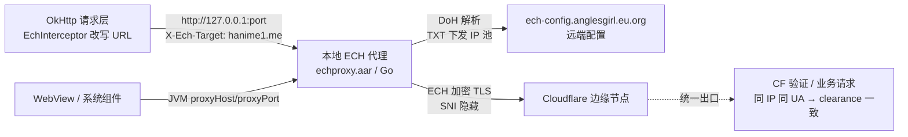

# 网络连接与 Cloudflare 验证分析：免梯直连优化方案

- 日期：2026-09-21
- 范围：本项目（`shared/src` 三端网络层）与参考项目 `reference/Han1meViewer-main`（anglesgirl/Han1meViewer）的网络/CF 实现对照
- 性质：分析文档，不含代码改动

---

## 1. 结论速览（TL;DR）

Han1meViewer 的"免梯直连"由**两层**构成：

1. **基础层（本项目已有，同源等价）**：内置 Hosts、DoH、备用域名切换、节点测速、Cloudflare 过盾。两项目同出 Yenaly Liew 上游，这部分架构几乎逐文件对应（`HDns.kt` ≈ `HanimeDns.kt`）。
2. **增强层（本项目缺失，直连的真身）**：**本地 ECH 代理**。一个打包进 App 的 Go 二进制代理（`echproxy.aar`），监听 `127.0.0.1`，对上游流量做 **ECH（Encrypted Client Hello）加密 TLS**，把 SNI 藏进加密信封；同时所有请求（含 WebView）统一从该代理出站。

因此"让用户不用梯子直连"的答案不是再加 hosts，而是**补上 ECH 层**：

- DNS 污染 → 内置 hosts / DoH 解决（已具备）
- **SNI 阻断 / DPI 识别 → ECH 解决（缺失，需移植）**
- 出口 IP 被 CF 风控 → 过盾拿 `cf_clearance`（已具备，但存在出口不一致缺陷）

推荐路线：**C（hosts 动态化，小而独立）→ B（本地正向代理统一出口）→ A（升级为 ECH 代理，完整对齐）**，详见 §5。

---

## 2. 本项目网络与 CF 架构梳理

### 2.1 请求链路与 DNS

- 入口 `HanimeNetwork`（`shared/src/commonMain/kotlin/lovehan1me/data/network/HanimeNetwork.kt`）：Ktor expect 工厂 `createXxxHttpClient()` + 服务构造，`rebuildNetwork()` 重建传输层与服务实例。
- 域名与 UA：`shared/src/commonMain/kotlin/lovehan1me/core/constant/NetworkConstants.kt`
  - 四域名：`hanime1.me` / `hanime1.com` / `hanimeone.me` / `javchu.com`（AV 站独立常量 `AV_URL`）
  - `baseUrl` 来自 `SettingsRepository.baseUrl`，支持自定义镜像覆盖（站点身份判定统一走 `SiteIdentity`）
- **DNS 解析链** `HanimeDns`（`shared/src/jvmMain/kotlin/lovehan1me/data/network/HanimeDns.kt`，`lookup()` L93-L118）：
  1. `www.getchu.com` → 固定 IP
  2. `useBuiltInHosts && hanime 域名` → 静态 IP（用户自定义优先，否则内置 `cloudFlareIps`：**5 个 IPv4 + 3 个 IPv6，硬编码**，L35-L38）
  3. DoH（若启用）→ 4. 系统 DNS → 5. 内置 IP 兜底（仅 Hanime 系域名）
- DoH（`shared/src/commonMain/kotlin/lovehan1me/data/network/DohConfig.kt`）：三预设 AliDNS / DNSPod / Cloudflare + 自定义 URL、bootstrap IP、超时（1-60s）。
- 代理 `HanimeProxySelector`（`shared/src/jvmMain/kotlin/lovehan1me/data/network/HanimeProxySelector.kt`）：
  - Direct / System / HTTP / Socks，通过 JVM 系统属性全局设置
  - **已知缺陷①（issue #39）**：代理不作用于 Android WebView（注释自述）

### 2.2 Cloudflare 验证（三端）

- **跨平台总线** `CloudflareChallenges`（`shared/src/commonMain/kotlin/lovehan1me/data/network/CloudflareChallenges.kt`）：
  - `CF_CLEARANCE_NAME = "cf_clearance"`；`request()` 广播挑战 → 各端压栈验证页；`passed()/abandoned()` 广播结局；`awaitPassed()` 唤醒挂起请求（父域通过也算通过）。
- **Android**：`CloudflareInterceptor`（`shared/src/androidMain/kotlin/lovehan1me/data/network/interceptor/CloudflareInterceptor.kt` L23-L39）检测 `403 + cf-mitigated: challenge` → `CloudflareVerificationCoordinator.verify()`（同 host 挑战合并、CountDownLatch 阻塞至多 5 分钟）→ `CloudflareRouteScreen` WebView 验证页（`shared/src/androidMain/kotlin/lovehan1me/app/web/CloudflareVerificationScreen.android.kt`）→ `persistCloudflareCookies` 写回。
- **桌面**：`CloudflareVerificationWindow.desktop.kt` + `CloudflareCdp.kt`（`shared/src/desktopMain/kotlin/lovehan1me/app/web/`）：
  - 查找本机 Chrome/Edge → **可见窗口 + `--user-data-dir` 独立 profile + CDP 注入**（不用 headless，防 CF 识别）
  - 启动参数**按设置透传 `--proxy-server`**（L244-L295），保证验证浏览器与请求出口一致（代理场景）
  - 轮询 `Network.getAllCookies`，拿到 `cf_clearance` 且离开挑战页才判成功；无浏览器/超时 → 手动兜底
- **iOS**：`CloudflareVerificationWebView.ios.kt`（`shared/src/iosMain/kotlin/lovehan1me/app/web/`）WKWebView 固定 UA，1.5s 轮询 `WKHTTPCookieStore` → `IosCookieBridge`（`shared/src/iosMain/kotlin/lovehan1me/data/network/IosCookieBridge.kt`）同步持久化到 DataStore；`BridgeCookiesStorage.get` 每次请求叠加 loginCookie + `cf_clearance` 并过滤过期内存凭据。
- **Cookie 层** `HCookieJar`（`shared/src/jvmMain/kotlin/lovehan1me/data/network/HCookieJar.kt` L27-L56）：`cf_clearance` 只认持久化那一份；`saveFromResponse` 合并策略，不覆盖 CDP 刚写入内存的 clearance。

### 2.3 已知痛点（本项目）

| 编号 | 痛点 | 位置/证据 |
|---|---|---|
| P0 | **CF 验证出口不一致**：应用走内置 IP（边缘 A），验证 WebView/CDP 走系统 DNS（边缘 B），`cf_clearance` 绑定出口 IP → 跨节点失效，"验证过了还是 403" | `strings.xml` L629（zh-rCN）自述"此问题目前无法解决" |
| P1 | 内置 IP 硬编码，无远端更新，失效需发版 | `HanimeDns.kt` L35-L38 |
| P2 | 代理不进 Android WebView | `HanimeProxySelector.kt` L49 注释（issue #39） |

---

## 3. 参考项目 Han1meViewer 直连实现分析

### 3.1 同源部分（基础层，两边等价）

参考项目路径前缀：`reference/Han1meViewer-main/app/src/main/java/io/github/daisukikaffuchino/han1meviewer/`

| 能力 | 参考项目 | 本项目 |
|---|---|---|
| 自定义 DNS | `logic/network/HDns.kt`（L91-L120 解析链：getchu 固定 IP → useBuiltInHosts 静态 IP → DoH → 系统；L172-L209 自定义 IP 缓存） | `HanimeDns.kt`（同构，多了"系统失败自动降级内置 IP"一档） |
| 客户端注入 | `logic/network/ServiceCreator.kt` L96-L108（`hClient` 绑 `.dns(dns)` + CloudflareInterceptor + EchInterceptor） | `HanimeNetwork.kt`（Ktor expect 工厂，等价） |
| CF 检测 | `interceptor/CloudflareInterceptor.kt` L12-L28（`403 + cf-mitigated: challenge`） | `CloudflareInterceptor.kt`（相同） |
| 验证协调 | `CloudflareVerificationCoordinator.kt` L31-L73（同 host 合并、5 分钟超时） | 同名文件（相同，本项目 M2 下沉 shared） |
| 节点测速 | `ui/navigation/settings/NetworkSettingsRoute.kt` L98-L163：`InetAddress.isReachable(2000)` ICMP/TCP 可达性延迟 + `runDohTest()` DoH 解析耗时 | `NetworkSettingsScreen.kt`（`view_node_latency`/`current_node_latency`，有测速 UI） |
| 备用域名/镜像 | 多域名 + baseUrl 切换 | 同（四域名 + 自定义镜像） |

**结论：基础层两项目等价，"打开内置 hosts 就能直连"的体验本项目理论上已具备。**

### 3.2 核心差异：本地 ECH 代理（增强层，本项目无对应实现）

本项目 `shared/src` 全量检索 `EchProxy|EchInterceptor|echproxy|X-Ech-Target|EchConfig` **零匹配**；参考项目有完整实现：

**组件与流程：**

1. **`logic/ech/EchProxyManager.kt`**（L20-L35、L68-L105、L187-L242）
   - 启动本地代理：选空闲端口，`Echproxy.start(...)` 监听 `127.0.0.1:<port>`，把站点流量经 **ECH TLS** 转发上游（SNI 加密，DPI 无法按域名阻断）
   - 远端配置：通过 DoH 查询 **`ech-config.anglesgirl.eu.org` 的 DNS TXT 记录**，拉取 `doh/doh2/doh3/ip`（DoH 服务与边缘 IP 池），写本地缓存
   - 启动后调用 `HProxySelector.rebuildNetwork()` 让系统代理指向本地 ECH 代理
2. **`logic/network/EchInterceptor.kt`**（L11-L24、L44-L63）
   - 所有 HTTPS 请求改写为 `http://127.0.0.1:<echPort>/path` + 请求头 `X-Ech-Target: <原host>`（`Host` 保持原域，手动注入原域名 cookie 防登录态丢失）
   - 代理未启动时直连兜底
3. **`logic/network/HProxySelector.kt`**（L63-L74、L109-L116）
   - ECH 开启且代理就绪 → 设置 JVM `proxySet/proxyHost/proxyPort` 指向本地代理，**`HttpURLConnection`/WebView 随系统属性走本地 ECH 代理**
   - OkHttp 侧返回 `Proxy.NO_PROXY`（URL 已被 EchInterceptor 改写，无需 CONNECT 隧道）
4. **`app/build.gradle.kts`** L120-L127：依赖 CI 产出的 `libs/echproxy.aar` —— **Go 编写的 ECH 代理，gomobile 打包为 Android 库**

**流量路径（ECH 开启时）：**



**该方案一石三鸟：**

- SNI 加密 → 穿透 SNI 阻断/DPI（真正"免梯"的部分）
- 应用与 WebView/系统组件统一从本地代理出站 → **验证页与请求同出口**（对应本项目 P0）
- WebView 随系统代理走本地代理 → **代理天然作用于 WebView**（对应本项目 P2/issue #39）

### 3.3 直连效果归因

| 障碍 | 解决手段 | 本项目状态 |
|---|---|---|
| DNS 污染 | 内置 hosts / DoH | ✅ 已有 |
| SNI 阻断 / DPI | ECH 加密 ClientHello | ❌ 缺失 |
| 出口 IP 被 CF 风控 | 过盾 `cf_clearance` | ⚠️ 已有但出口不一致导致可靠性打折 |
| 域名封锁 | 备用域名/镜像 | ✅ 已有 |

---

## 4. 优化方案

### 方案 A：移植本地 ECH 代理（完整对齐参考项目）

**组成：**

1. ECH 代理运行时：复用或自建 Go 代理（参考 `echproxy`，gomobile 产物）
   - Android：`echproxy.aar`（可直接对接参考项目 CI 产物或自建）
   - Desktop：Go 编译 exe 随包分发
   - iOS：gomobile framework（工作量最大）
2. `commonMain` EchInterceptor：Ktor 拦截器做 URL 改写 + `X-Ech-Target`（三端共享，比参考项目的 jvmMain 更进一步）
3. `HanimeProxySelector` 扩展：ECH 开启时 JVM 属性指向本地代理；Android WebView 走系统属性跟随
4. 远端配置：自建（Cloudflare DNS TXT / Worker JSON），含 DoH 地址与 IP 池；本地缓存 + 硬编码兜底

**解决**：P0（出口一致）+ P2（WebView 代理）+ SNI 阻断。
**风险/成本**：Go 工具链与三端打包；配置分发域名需自建维护；ECH 依赖 CF 侧支持（hanime 站在 CF 后，已支持）；CF 若升级 Turnstile 对 TLS 指纹校验加严，需跟进。

### 方案 B：本地正向代理统一出口（ECH 的退化版）

不引入 Go 代理，纯 Kotlin（Ktor server / 手写 CONNECT 隧道约百行）在 `127.0.0.1` 起正向代理，出站统一走 `HanimeDns + HanimeProxySelector`：

- Android WebView：`androidx.webkit` `ProxyController.setProxyOverride` 指向本地代理
- 桌面：CDP 启浏览器时 `--proxy-server=127.0.0.1:port`（现有透传逻辑已具备雏形）

**解决**：P0 + P2；**不解决** SNI 阻断。工程量远小于 A，是 A 的第一步——A 相当于把 B 的代理换成带 ECH 的 Go 实现。

### 方案 C：内置 hosts 动态化 + 测速排序（独立小改进）

- 远端 JSON（GitHub raw + jsdelivr 镜像）维护 IP 池，本地缓存 + 现有硬编码兜底
- 启动/设置页并发测速（升级现有 `isReachable` 为 TCP+TLS 握手耗时），按延迟排序供 `HanimeDns` 返回
- **解决**：P1。独立可先行，无平台差异。

### 推荐实施顺序

```
C（1 个迭代内，独立收益）
  → B（解决出口一致性 + WebView 代理）
    → A（换 ECH 代理内核 + 远端配置，完整免梯）
```

---

## 5. 直连的现实边界（预期管理）

| 场景 | 能否免梯 | 依据 |
|---|---|---|
| DNS 污染 | ✅ | hosts/DoH |
| SNI 阻断 / DPI 识别 | ✅（需方案 A） | ECH 加密 |
| 出口 IP 触发 CF 盾 | ✅ | 过盾；出口统一后 clearance 稳定 |
| 目标 IP 黑洞 / 协议级封锁 | ❌ | 只能代理（Han1meViewer 同样如此，其"代理相关设置"即为此兜底） |

---

## 6. 附录：关键文件索引

**本项目：**

| 模块 | 文件 |
|---|---|
| DNS 链/内置 IP | `shared/src/jvmMain/kotlin/lovehan1me/data/network/HanimeDns.kt` |
| DoH 配置 | `shared/src/commonMain/kotlin/lovehan1me/data/network/DohConfig.kt` |
| 代理选择器 | `shared/src/jvmMain/kotlin/lovehan1me/data/network/HanimeProxySelector.kt` |
| CF 总线 | `shared/src/commonMain/kotlin/lovehan1me/data/network/CloudflareChallenges.kt` |
| CF Cookie 层 | `shared/src/jvmMain/kotlin/lovehan1me/data/network/HCookieJar.kt` |
| Android CF 拦截/协调/验证页 | `shared/src/androidMain/kotlin/lovehan1me/data/network/interceptor/CloudflareInterceptor.kt`、`.../CloudflareVerificationCoordinator.kt`、`shared/src/androidMain/kotlin/lovehan1me/app/web/CloudflareVerificationScreen.android.kt` |
| 桌面 CDP 验证 | `shared/src/desktopMain/kotlin/lovehan1me/app/web/CloudflareCdp.kt`、`CloudflareVerificationWindow.desktop.kt` |
| iOS 验证/桥接 | `shared/src/iosMain/kotlin/lovehan1me/app/web/CloudflareVerificationWebView.ios.kt`、`shared/src/iosMain/kotlin/lovehan1me/data/network/IosCookieBridge.kt` |
| 域名常量 | `shared/src/commonMain/kotlin/lovehan1me/core/constant/NetworkConstants.kt` |
| 出口不一致自述 | `shared/src/commonMain/composeResources/values-zh-rCN/strings.xml` L629（`cloudflare_network_mismatch`） |

**参考项目（前缀 `reference/Han1meViewer-main/app/src/main/java/io/github/daisukikaffuchino/han1meviewer/`）：**

| 模块 | 文件 |
|---|---|
| ECH 代理管理 | `logic/ech/EchProxyManager.kt` |
| ECH 请求改写 | `logic/network/EchInterceptor.kt` |
| 代理选择器（ECH 联动） | `logic/network/HProxySelector.kt` |
| Go 代理依赖 | `app/build.gradle.kts` L120-L127（`libs/echproxy.aar`） |
| 自定义 DNS | `logic/network/HDns.kt` |
| 客户端注入 | `logic/network/ServiceCreator.kt` |
| CF 拦截/协调 | `logic/network/interceptor/CloudflareInterceptor.kt`、`logic/network/CloudflareVerificationCoordinator.kt` |
| 节点测速 | `ui/navigation/settings/NetworkSettingsRoute.kt` L98-L163 |
