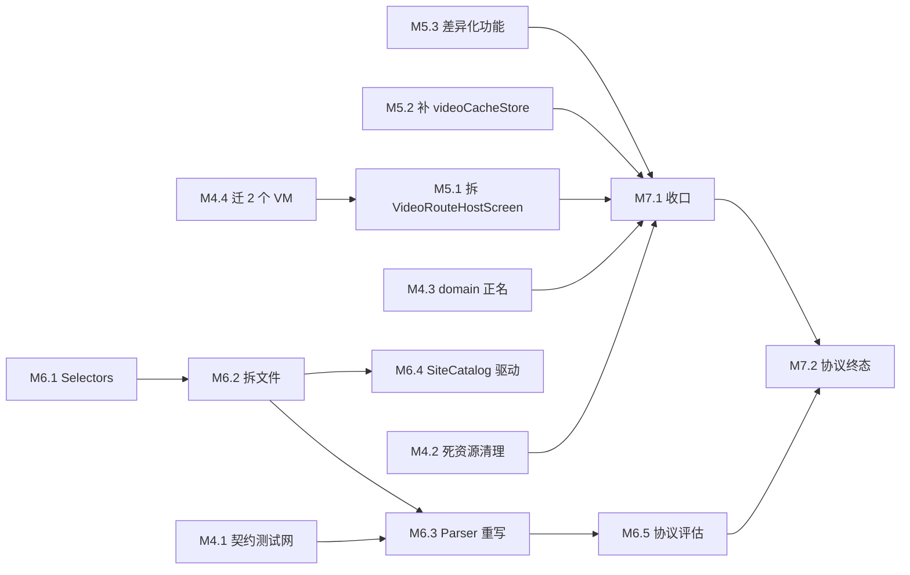

# LoveHan1me 中后期攻坚规划（代码依据版）

> 生成时间：2026-09-20 00:40 ｜ **v2，作废 v1（`中后期攻坚规划-增量版-2026-09-19.md`）**
> v1 被否决原因：混入了项目笔记里的二手数字与提交信息推断。
> **本版依据：仅本次会话实际读取的文件内容。未读 `docs/*.md`，未查 `git log`。**
> 所有结论附 `文件路径:行号`；**测不了的项明确标注"测不了"，不给数字。**

---

## 0. 本版相对 v1 的修正（先看这里）

| 项 | v1（错误/存疑） | v2（实测） |
|---|---|---|
| 相似度来源 | 转述项目笔记 | **架构师亲手执行** `tools/license_similarity_scan.py`，输出 `high=179 mid=39 total=439` |
| 改名搬运（`HanimeDns.kt ← HDns.kt` 98.7% 等 4 例） | 当作已确认事实 | **无法复现、本版不再引用**。脚本 `:72-89` 用 `up_by_name` 按文件名配对，改名即隐身（脚本 `:6-10` KDoc 自陈）。**要测必须先升级 shingle** |
| desktopMain / iosMain 文件数 | 53 / 40 | **50 / 62**（iosMain 漏了 22 个） |
| ViewModel 数量 | ~17 | **20 个具体 VM**，其中 `: ViewModel()` 14 个、`: AbstractViewModel` **仅 1 个** |
| UI 直连 data 最严重项 | `VideoRouteHostScreen` 21 处 | `VideoRouteHostScreen` **18 处 `Repository` + 2 处 `Repo`**；**真正的 UI 层最严重项是 `VideoRouteActions.kt` 7 处** |
| 巨型函数 | "1076 行文件" | **是单个函数**：`VideoRouteHostScreen()` 横跨 `:128-1041` = **914 行**，文件共 1076 行 |
| `:app` 死资源 | 702 条 | **2,066 条**（values 703 + zh-rCN 682 + zh-rTW 682 = 2,067，仅 1 条被用） |
| 弹幕设置项 | 9 项 | **12 项**（`AppSettings.kt:191,196,204,206,211,216,218,225,227,234,235,236`） |
| Parser 覆盖率 | "实为 0" | **本机有夹具能跑、但不入库**：`.workbuddy/_javchu_home.html` 存在，`.gitignore:18` 排除 → **新 clone 后归零** |
| androidTest | 未提 | **不存在**（`:shared` 无 androidTest 源集）；commonTest 205 / desktopTest 81 / iosTest 7 个 `@Test` |
| 多站点 / 签到 | 列为差异化 | **上游已有，属继承，已剔除出差异化矩阵**（上游有 `GetchuNetworkRepo.kt`/`GetchuPreviewRoute.kt`、`MainDrawerDestination.kt:23-27` 的 `DailyCheckInRoute` + `CheckInRecordDao.kt`） |
| 榜单 | "能力现成=原创" | **数据是与上游逐字符相同的继承项**；上游同样没做榜单页 → 差异化精确落在「**把继承来的 sort 产品化**」 |

---

## 1. 实测基线：哪些数字能给，哪些给不了

### 1.1 相似度（架构师亲自跑脚本）

```
PS> D:\zengzijian\python.exe E:\LoveHan1me\tools\license_similarity_scan.py
written: E:\LoveHan1me\.workbuddy\license-scan-report.txt
high=179 mid=39 total=439
```

报告 `.workbuddy/license-scan-report.txt` 实测：
- 上游可比 272 / 我方可比 439
- high(≥0.75) **179**、mid 39、low 10、none 211 → **强派生 179/439 = 40%**
- 强派生合计 **22,408 行**；其中 **100% 逐字相同 36 个文件 / 1,821 行**
- 单项：`site/hanime1/Parser.kt` **96.3%（1019 归一化行）**、`site/getchu/GetchuParser.kt` 92.8%（543）、`data/NetworkRepo.kt` 82.2%（548）、`feature/preview/ComposePreviewDataSource.kt` 98.9%（526）、`ui/component/lazy/AnimatedLazy.kt` 99.3%（352）、`feature/home/WatchHistoryScreen.kt` 88.3%（623）、`feature/settings/NetworkSettingsScreen.kt` 83.0%（681）、`app/.../SafFileManager.kt` **100%（334）**、`app/.../HanimeDownloadManager.kt` 99.6%（241）

⚠️ **测量边界（重要）**：该脚本按文件名配对，**改名搬运类派生测不出来**。因此 **40% 是下界，真实派生面更高**。
⇒ **在 shingle 版脚本落地前，任何"去 fork 化完成度 X%"的说法都不可信。**

### 1.2 规模

| 源集 | 文件 | 行数 |
|---|---|---|
| commonMain | 414 | 59,841 |
| androidMain | 55 | 2,831 |
| jvmMain | 27 | 1,429 |
| desktopMain | 50 | 2,730 |
| iosMain | 62 | 2,418 |
| `app/src` | 28 | 3,410 |

---

## 2. 法律与工程的分界线（先讲清楚，避免做无用功）

> **GPLv3 是传染性 copyleft，不是相似度阈值。** 只要分发二进制就必须提供完整源码 + GPLv3 授权，与相似度是 40% 还是 5% **完全无关**。相似度数字不产生任何法律效力。

真实目标排序：
1. **消除逐字复制痕迹**（36 个 100% 相同文件、2,066 条死 strings）—— 法律/声誉**必要项**，逐字复制最易被举证
2. **提升可改动性**（914 行巨型函数、Parser 不可测）—— 工程**必要项**
3. 降低相似度数字本身 —— **不是目标**

**改写三问**（改一处代码前问）：
- Q1 更好读 / 更好测 / 更好改吗？**否 → 不做**
- Q2 是「功能性事实」吗（CSS 选择器、URL 路径、协议字段名）？**是 → 不做**，改了会错
- Q3 是「表达性内容」吗（注释、文案、命名、组织）？**是 → 做**

**明确禁止**为刷数字做同义词替换 / 变量重命名 / 调缩进。

**三个指标（只有第 3 个是硬指标）**：
1. DLF = 179/439（参考值）
2. DLR = 22,408 / 可比总行数（参考值，**不设目标**）
3. **NDL（新增代码中与上游 ≥0.75 的行数）= 0** ← 每 PR 检查。**这是唯一能阻止"边重写边又抄进来"的指标**

---

## 3. 立刻可做：三个最高 ROI 动作

| # | 动作 | 成本 | 收益与证据 |
|---|---|---|---|
| ① | 删 `:app` 那 **2,066 条零引用死 strings** | 10 分钟 / 零风险 | `app/src/main/kotlin` 下 `R.string.` = **0**；`app/src/main` 下 `@string/` 仅 `AndroidManifest.xml:30` 一处。消除最易被举证的逐字复制 |
| ② | **Parser 夹具入库 + 测试迁 commonTest** | M | 把"新 clone 后归零"的覆盖率变成三端可跑。三个源集**现在都没有 resources 目录** |
| ③ | 用 `@Stable VideoRouteHostState` 把 **18 处 Repository 收敛成 1 个** | M | 拆 914 行函数的唯一低成本起点，**纯搬家、0 行为变更** |

配套清理：
- 删 `feature/player/PlaceholderPlaybackEngine.kt:12`（全仓仅命中自己的声明行，零引用；误导性注释比死代码更贵）
- 删 `LICENSE-APACHE`（10,751 bytes，保留 `NOTICE` 段落即可）
- `ui/theme/GeneratedThemeBoards.kt` 标 `linguist-generated`，**从相似度分母排除**（否则 40% 虚高）

---

## 4. 差异化主战场

> ⚠️ **§4 已被 `docs/数据源能力裁定-2026-09-20.md`（v2 修正版）取代，请以后者为准。**
> 本节原推理缺陷：从「Parser 解析出了某个字段」直接推出「可以做某个产品功能」，跳过了「站点是否提供该端点」这一步。
> 修正后结论：**系列页**（`getMyPlayListItems` + `Parser.myPlayListItems` 已存在，只需加 `sort` 参数与 UI）与**榜单页**（`/search?sort=` 已生效，只需 UI 入口）成本远低于本节估计；**作者页**需新增 `/user/{uid}` 解析器；**热搜联想**站点无端点，砍掉。

### 4.1 前提修正：区分「继承」与「原创」

**上游 `Han1meViewer-main` 已有、本项目不算原创的**：多站点 getchu（`GetchuNetworkRepo.kt` / `GetchuParser.kt` / `GetchuPreviewRoute.kt`）、每日签到（`MainDrawerDestination.kt:23-27` + `CheckInRecordDao.kt`）。

**榜单的准确定性**：上游 `sort_option.json` 与本项目**逐字符相同**（同 9 key，含本日/本週/本月排行），上游 `HomeCategoryConfig.kt:37-38` 也同样复用 `ranking_today`/`ranking_this_month` 作标题。
⇒ **数据是继承的，两边都没产品化。差异化精确落在「把继承来的 sort 变成一等发现维度」，不是「我们有独有数据」。对外表述必须准确。**

### 4.2 Parser 取出但几乎没被消费的字段（实测）

`site/hanime1/Parser.kt` 实际取值点：列表卡 `hanimeNormalItemVer2`(:291-320) 取 title/coverUrl/videoCode/duration/**views:304**/**reviews:307**；详情 `hanimeVideoVer2`(:371-668) 取 **likesCount:392 / unlikesCount:394 / views:410 / playlist:444-542 / artist:612-638（含 artistId:618-630）/ originalComic:639**；订阅页 :1083-1137 取 **views:1111 / reviews:1114**。

| 字段 | 解析处 | UI/VM 消费 | 判定 |
|---|---|---|---|
| `views` | :304 / :410 / :466 / :510 / :1111 | `VideoCardItem.kt:192`、`VideoIntroductionSections.kt:294,297` | **仅 2 处展示，无排序/榜单** |
| `reviews` | :307 / :465 / :517 / :1114 | `VideoCardItem.kt:289-298` | **仅 1 处** |
| `likeRatio`/`ratingCount` | `HanimeVideo.kt:47-57`（由 :392/:394 算出） | `VideoIntroductionSections.kt:421` | **仅 1 处** |
| `playlist` | :444-542（两种 DOM 形态） | `VideoIntroductionBlocks.kt:311-417`、`VideoIntroductionDialogs.kt:432-570`、`VideoRouteHostScreen.kt:688` | **3 处全在详情页内，无独立页** |
| `artist` | :612-638 | `VideoIntroductionScreen.kt:415-420`、`VideoRouteActions.kt:64-79`（**`openArtistSearch` 直接跳 `SearchRoute(query=artist.name)`**）、`VideoViewModel.kt:494-517` | **无聚合页，点作者=关键词搜索** |
| 评论 `thumbUp`/`replyCount`/`hasMoreReplies` | `VideoComments.kt:23,27,29` | 有渲染 | **无排序维度** |

### 4.3 P0 需求池

| ID | 需求 | 价值与代码证据 | 关键落点 | 工作量 | 三端 |
|---|---|---|---|---|---|
| **P0-1** | **发现页排序条 / 榜单入口**：把 `sort` 从搜索参数提升为一等发现维度 | `sort_option.json` 9 项含 `本日排行`(27)/`本週排行`(36)/`本月排行`(45)/`觀看次數`(54)/`讚好比例`(63)/`他們在看`(72)/`時長最長`(81)；`HanimeBaseService.kt:29-51` 签名含 `sort`，`:44` 直接 `parameters.append("sort", sort)`；`SearchViewModel.kt:76` 已加载 → **网络/解析零改动**。上游与本项目都没产品化它 | `MainTab.kt:45-49`（DiscoverTab 已存在）、`SearchRoute.kt:42`（`autoBrowse` 已存在）、新增 `feature/search/RankingChips.kt` | **M** | ✅ 全覆盖 |
| **P0-2** | **系列 Playlist 独立页** | 上游 `HanimeScreen.kt` 15 个 route 中**无 PlaylistRoute**；`Parser.kt:444-542` 已解析两种 DOM 形态 | `HanimeVideo.kt:106-109`、`VideoIntroductionBlocks.kt:311`、`VideoRouteHostScreen.kt:688`（playingIndex 可复用） | **M** | ✅ 全覆盖 |
| **P0-3** | **演职员聚合页** | 上游 `HanimeScreen.kt` **无 ArtistRoute**，其 `VideoRouteActions.kt:44` 同样是跳搜索；`Parser.kt:618-630` 已取到 `artistId`/`userId`/`subscribe-status` | `HanimeVideo.kt:111-125`、`VideoRouteActions.kt:64-79`、`VideoIntroductionScreen.kt:415-420`、`HanimeSubscriptionService.kt:21-29` | **M**（首版「作者头+搜索网格」可压到 **S**） | ✅ 全覆盖 |
| **P0-4** | **弹幕来源可观测化 + 密度分档** | 弹幕是完整实现（见 §4.4）但用户无感；`CommentDanmakuMapper` 的自动跳弹弹逻辑目前**静默发生**，用户会以为"没匹配上" | `DanmakuStatusBar.kt`、`data/danmaku/CommentDanmakuMapper.kt`、`feature/danmaku/DanmakuSession.kt` | **S** | ✅ 全覆盖 |
| **P0-5** | **本地库按播放量 / 好评率排序** | `DisplayTextLocalizer.kt:7` 正则 + `:96` `toKViews()` **已能解析** "44.9万次"，只是没人调 | `DisplayTextLocalizer.kt:7,96`、`LocalListItemEntity.kt`、`OnlineWatchHistorySort.kt` | **S** | ✅ 全覆盖 |

### 4.4 弹幕：确认真接线，属"已完工可深化"而非待办

- `VideoRouteHostScreen.kt:86-89` import `DanmakuLayer`/`DanmakuControls`/`rememberDanmakuSession`/`rememberDanmakuRenderOptions`
- `:753-770` 建 session，受 `SettingsRepository.current.danmakuCommentEnabled`(:760) 门控；`:925-945` 渲染 Layer 与 Controls
- `AppSettings.kt` 弹幕设置 **12 项**（:191,196,204,206,211,216,218,225,227,234,235,236）；`DataStoreManager.kt:157-158` 读 / `:190-195` 写 11 个 key → **真持久化**
- 测试 6 个：`DanmakuDataTest` / `DanmakuClockCadenceTest` / `DanmakuEngineTest` / `DanmakuPositionTrackerTest` / `DanmakuRenderOptionsTest` / `DanmakuSessionTest`
- 上游 `danmaku|弹幕` 仅命中 strings.xml → **上游无实现**；animeko 有自己一套 → **本项目"站内评论主源 + 弹弹 play 时间轴增强"的组合是独占的**

### 4.5 P1 / P2

| ID | 需求 | 说明 | 工作量 |
|---|---|---|---|
| P1-6 | 评论热评排序 + 楼层展开 | `VideoComments.kt:23/27/29` | S |
| P1-7 | 弹幕深化（本地 .xml/.ass 源 + 屏蔽规则） | `data/danmaku/DanmakuRepository.kt` / `DanmakuProvider.kt` | M |
| P1-8 | **桌面画中画** | ⚠️ 不是新功能，是**补空实现**：`DesktopVideoPageHost.kt:28` = `override fun enterPipMode() {}`；iOS `IosVideoPageHost.kt:92-187` 用 `AVPictureInPictureController` 是真实现，Android `AndroidVideoPageHost.kt:108-147` 也是真的 | M，仅桌面 |
| P1-9 | 按视频倍速记忆 + 画面缩放 | ⚠️ 全局倍速**已实现**（`AppSettings.kt:167`），只做 per-video 与缩放 | S–M |
| P2-10 | 热搜/联想 | 全仓 `hotSearch\|suggest\|trending\|热搜\|联想` 零命中（需先探测站点有无接口） | S–M |
| P2-11 | 外挂字幕 | 全仓零命中；但 animeko 有（`SubtitleSwitcher.kt`）→ **属补齐非差异化** | M |
| P2-12 | **MediaSession / 后台播放** | 上游无、animeko 零命中 → **两端皆无 = 真差异化**，PM 建议考虑从 P2 提 P1 | L，Android 优先 |

---

## 5. 架构债治理（按 ROI 排序）

### 5.1 `core/domain` → **不补 UseCase，只正名**
实测 36 个文件：exception 6 / model 25 / state 5 / **UseCase 零**（无 `usecase` 包，全仓 `*UseCase*` 文件名零命中）。
理由：① 第一原则是「可改动性 > 完整性」，补 UseCase = 20 个 VM 各加一层转发；② 真债是 **UI 越权**（`VideoRouteActions.kt` 7 处、`VideoRouteHostScreen` 18 处），补 UseCase **不解决它**；③ 红线「❌ 编译期架构门禁」意味着**没有手段强制新代码走 UseCase**，这层会两周内腐化。
执行：改包 KDoc 写明「共享 model/state/exception 层，**不是** Clean Architecture 的 domain」；只给跨 feature 复合逻辑建 `usecase\`，**≤5 个**。

### 5.2 `VideoRouteHostScreen()` 914 行拆分（`:128-1041`）
实测内部：`LaunchedEffect` **22** 个、`remember` **39** 个、`DisposableEffect` 3 个、`collectAsState` 5 个、参数 9 个（`:129-138`）。
- **S1（0 行为变更）**：`:1049/1052/1073` 三个 private helper → 新建 `feature/video/PlaybackFormat.kt`；18 处 `Repository` 收敛进 `@Stable class VideoRouteHostState`，参数降为「1 个 state + 5 个回调」
- **S2**：按 UI 区块抽 `@Composable` → `feature/video/component/`（TopBar / PlayerSection / InfoSection / CommentSection / RelatedSection）
- **S3**：22 个 `LaunchedEffect` 归拢到 `VideoRouteHostState.Companion.remember()`
- **S4**：Repo 引用从 UI 消失，只由 `VideoViewModel` 提供
- **验收**：函数跨度 ≤300 行；函数体内 `Repository` 命中 = 0；`:shared:desktopTest --max-workers=1` 全绿
- ⚠️ **风险**：抽 `@Composable` 时 lambda 必须写 `@Composable () -> Unit`、变化入参用 `rememberUpdatedState`，否则 39 个 `remember` 会导致重组范围变化 → **性能回退**

其余巨型函数（按函数跨度实测，非文件行数）：`VideoPlayerUi()` 768 行（`VideoPlayerUi.kt:150-917`）、`SharedTopNavigation()` 479 行（`:106-584`）、`HomeSettingsRouteScreen()` 382 行（`:117-498`）、`AccountContent()` 372 行（`:230-601`）。

### 5.3 `AbstractViewModel` → **不全量迁**
20 个 VM 全迁 = 20 次机械改动换「统一异常落点」，**不划算**。只优先迁 `VideoViewModel`（7 处 data import）+ `SearchViewModel`（4 处、零用例）；其余在因功能改动打开该文件时顺手迁。

### 5.4 DI → **不建议引入 Koin**
实测 `object` 单例声明 **117 处**；`sharedViewModel|viewModelFactory|AppViewModelStore` 命中 18 个文件。确实乱但**能用且三端已验证**。Koin 是运行时 Service Locator，把「编译期可见的依赖」变成「运行时解析」，**降低**改错发现速度；KMP + Navigation3 + 配置缓存下还要处理 `startKoin` 时机 / 桌面重启 / iOS `KoinApplication` 生命周期。
替代：新建 `app/di/AppGraph.kt` 集中登记 117 个单例 + 暴露 `installForTest()`。再评估触发条件：某 VM 构造参数 ≥3 或需 scoped 实例。

### 5.5 `SiteCatalog` → **M6 再做**
改 baseUrl 来源会牵动 `CloudflareCdpTest` / `CloudflareCdpLiveTest`，会与播放器、体验任务抢回归窗口。验收网已存在：`JavchuHomePageParseTest.kt:105-138` 的 `SiteIdentityTest` 已把 `isAvSite` 语义钉死。

---

## 6. 平台缺口清单（74 个 `expect` 中的空实现，实测）

| expect 声明 | actual | 实现 |
|---|---|---|
| `PlatformStores.kt:9 videoCacheStore` | `.desktop.kt:16` / `.ios.kt:10` | **no-op**（`load() = flowOf(null)`）→ **真 bug**：Android 写 `info.json`，桌面/iOS `fromDownload` 读不到 |
| `AppRestart.kt:7 restartApp` | `AppRestart.ios.kt:4` | `{}` |
| `HomePlatformActions.kt:33 applySecureMode` | `.desktop.kt:74` / `.ios.kt:61` | `{}` |
| `HomePlatformActions.kt:36 recreateActivity` | `.desktop.kt:77` / `.ios.kt:63` | `{}`（android:72 有） |
| `HomePlatformActions.kt:43 openPerAppLinksSettings` | `.desktop.kt:79` / `.ios.kt:65` | `{}` |
| `HomePlatformActions.kt:46/49` PiP 权限 | `.desktop.kt:82,83` / `.ios.kt:68,69` | 恒 `true` / `{}` |
| `NavigationPlatform.kt:8 navigateToArtistSearch` | `.desktop.kt:3` / `.ios.kt:3` | `{}`（android:14 有）→ **与 P0-3 作者页直接相关** |
| `CrashRecovery.kt:22 installCrashHandler` | `.android.kt:6` / `.ios.kt:30` | `{}` |
| `ProxyPlatform.kt:16 rebuildSystemProxy` | `ProxyPlatform.ios.kt:4` | `{}` |
| `HanimeAccount.kt:20 clearWebCookies` | `.desktop.kt:6` / `.ios.kt:13` | `{}` / 注释体 |
| `VideoPlatform.kt:16/19` | `.desktop.kt:11,14` / `.ios.kt:10,13` | `isActiveNetworkMetered` 恒 false；`BindOrientationAutoFullscreen` `{}` |
| `PlayerBatteryIndicator.kt:38` | `.desktop.kt:7` / `.ios.kt:7` | `null` |
| `ComposeActions.kt:13 createTextClipEntry` | `.ios.kt:12` | `null` |
| `ComposeAssetsSync.kt:13 readComposeFileSync` | `.ios.kt:4` | `null` |
| `DynamicSchemeProvider.kt:27/33` | `.desktop.kt:19,22` / `.ios.kt:18,21` | `null` / `= Unit` |
| `IsDebugBuild.kt:9 isDebugBuild` | `.desktop.kt:4` / `.ios.kt:4` | 恒 `false` |

**硬编码不对称**：`Orientation.desktop.kt:7` 恒 `true`、`Orientation.ios.kt:6` 恒 `false`；`feature/video/VideoShellContent.kt:136` 注释自陈「iOS 侧 `isLandscapeOrientation()` 恒 false → **iPad 永远拿不到双栏**」。这是已知未修的功能缺口。

---

## 7. 风险防护网：解析器契约测试

**先堵洞**：`commonTest` / `desktopTest` / `iosTest` **三个源集均无 `resources` 目录**；夹具 `.workbuddy/_javchu_home.html`(313KB)、`_watch.html`(5.7KB) 被 `.gitignore:18` 排除 → **新 clone 后 Parser 覆盖率归零**。

- 建 `shared/src/commonTest/resources/fixtures/hanime1/`；单文件 ≤150KB、全仓 ≤1.5MB；只留 `<body>` 必要子树 + `<head>` script（`hanimeVideoVer2` 依赖 `const source = '...'`）
- 脱敏脚本入库 `tools/sanitize_fixture.py`（token / 用户名 → 占位符）
- 夹具读取统一走 `commonTest/kotlin/lovehan1me/test/Fixture.kt` 的 `readFixture()`，**废弃 `JavchuHomePageParseTest.kt:68-76` 的 `File(System.getProperty("user.dir"))` 逐级向上找** —— 该写法在 iOS 下不可用，是跨端迁移的直接障碍

| 层 | 内容 | 位置 |
|---|---|---|
| L1 结构契约 | 每板块非空 + 关键字段不为空 | **commonTest**（把 `JavchuHomePageParseTest` 从 desktopTest 迁过来） |
| L2 字段快照 | 结果 JSON 存 `fixtures/expected/*.json`，排除易变字段后断言相等 | commonTest |
| L3 Live 冒烟 | `@Tag("live")`，超时 15s、重试 1 次、只断言非空 | desktopTest，默认不跑 |

**改版报警**：L1 对「结构性字段全空」做专门断言，失败信息写明「检查 `div[id=home-rows-wrapper]` 是否仍存在」；新增 `SiteHealthCheckTest`（L3，每周手动跑）作哨兵。

**优先级：Parser > ViewModel > NetworkRepo > UI**
- Parser 第一：站点改版的唯一缓冲，现为 0 覆盖
- ViewModel 第二：`AbstractViewModel` 已提供 `bgContext` 注入点，传 `StandardTestDispatcher` 即可测，**成本最低 ROI 最高**
- NetworkRepo 第三：Ktor 薄封装，核心逻辑被 Parser 测试间接覆盖
- UI 最后：只在 §5.2 拆分时补区块级渲染测试

**当前测试分布**：commonTest 205 个 `@Test`、desktopTest 81、iosTest 7；**`:shared` 无 androidTest 源集**（需确认 `build-logic` 的 `withHostTest {}` 是否让 commonTest 进入 Android）。

---

## 8. 路线图 M4 → M7+

**M4 结构收尾**（三条可并行，互不碰文件）
- **M4.1** fixture 入库 + `Fixture.kt` + Parser L1/L2 契约测试 + `JavchuHomePageParseTest` 迁 commonTest
- **M4.2** 删 `app/res/values*` 2,066 条死 strings + `LICENSE-APACHE` + `PlaceholderPlaybackEngine`
- **M4.3** `core/domain` 正名（只改 KDoc）
- **M4.4** `AbstractViewModel` 迁 `VideoViewModel` + `SearchViewModel`
- **验收**：`:shared:desktopTest --max-workers=1` 全绿；干净 clone 上 Parser 测试可跑且有意义

**M5 体验**：M5.1 `VideoRouteHostScreen` S1→S4 ｜ M5.2 补 `videoCacheStore` desktop/ios no-op（真 bug）｜ M5.3 差异化功能 P0-1~5
**M6 Parser 重写**：M6.1 `Selectors.kt` → M6.2 拆文件 → M6.3 逐入口重写（`useNewParser` 双跑开关）→ M6.4 `SiteCatalog` 驱动网络层 → M6.5 协议评估
**M7+**：M7.1 收口 ｜ M7.2 协议终态

- **可并行**：M4.1 ∥ M4.2 ∥ M4.3；M5.2 ∥ M5.3 ∥ M6.1
- **必须串行**：M4.1 → M6.3（先有网再动刀）；M4.4 → M5.1（VM 先迁基类，拆 UI 才有统一状态落点）；M6.2 → M6.4
- **不要并行**：M5.1 与 M6.4 —— 都要大量手动回归，会互相污染回归窗口



---

## 9. 待确认问题

| # | 问题 | 影响 |
|---|---|---|
| 1 | **Parser fixture 能否入库**（接受"结构骨架 + 占位文本"？） | 不入库则风险防护网不成立 |
| 2 | **协议终态**：接受 GPLv3 长期存续，还是必须换？换协议需 M6.3 全量重写 + 法务确认，工作量是「只做架构治理」的 **3–4 倍** | 决定 M6 投入上限 |
| 3 | **914 行 Composable 拆分窗口**：无法原子提交，是否接受 M5 期间 UI 有 1–2 次短期不可用 | 影响 M5 排期 |
| 4 | **`videoCacheStore` desktop/ios no-op**：算必须修的 bug 还是已知不做 | 影响 M5 排期 |
| 5 | **`sort=本日排行` 返回全站还是当前分类** | 决定榜单页是否带 genre 过滤 |
| 6 | **作者页首版**用 `SearchRoute(query=name)` 复用搜索（S）还是新增订阅页数据源（更准但要新解析） | 决定 P0-3 成本 |
| 7 | **MediaSession 两端皆无**（上游无、animeko 零命中），要不要从 P2 提到 P1 作为真差异化 | 影响排期 |
| 8 | **是否引入 Ktor `MockEngine`** 作 test 依赖（换来 NetworkRepo 可测） | 多一个测试依赖 |
| 9 | **`jvmMain/.../NetworkSettingsRoute.kt` 与 `commonMain/.../NetworkSettingsScreen.kt`(681 行)** 的分工未核实 | 需核实后再定是否搬动 |
| 10 | **若本批次只做 2 项**：「榜单+作者页」（可见度最高）还是「榜单+系列页」（数据消费最完整）？ | 建议：榜单 + 作者页 |

---

## 10. 一句话总结

**相似度数字不是目标，NDL=0 才是硬指标；在 shingle 版脚本落地前，任何"完成度 X%"都不可信。**
本批次最高 ROI 三件事：① 删 `:app` 那 2,066 条零引用死 strings（10 分钟、零风险）；② fixture 入库 + Parser 测试迁 commonTest；③ 用 `@Stable VideoRouteHostState` 把 18 处 Repository 收敛成 1 个。
差异化主战场是**榜单页 / 系列页 / 演职员页 / 弹幕可观测化 / 本地库热度排序**——但要说准：榜单数据是继承来的，原创性在于「产品化」；多站点与签到是继承项，**不能再当原创卖点**。
